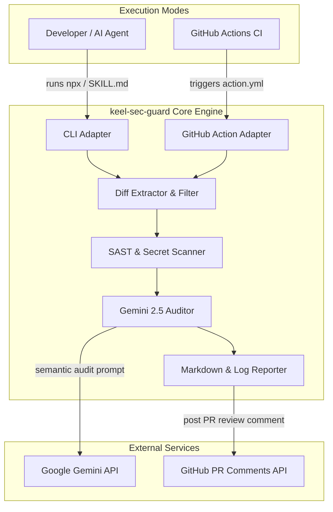

# 🛡️ Keel Security Guard (`keel-sec-guard`)

[](https://github.com/sakhujarohan/keel-sec-guard/releases)
[](LICENSE)
[](https://www.typescriptlang.org/)
[](https://nodejs.org/)
[](action.yml)

> **Hybrid SAST + Google Gemini Security Reviewer for Developer & AI Agent Pull Requests.**

`keel-sec-guard` is a lightweight, dual-mode security auditing tool that protects your codebase from hardcoded credentials, structural AST vulnerabilities, and logic flaws. It combines deterministic static analysis with **Google Gemini 2.5** semantic code analysis, running **locally via CLI / Agent Skill** and **in CI/CD via GitHub Actions** with $0 in API costs using free Google AI Studio credentials.

---

## ✨ Features

- **⚡ Hybrid Security Engine**: Combines 100% deterministic secret/OWASP scanning with Google Gemini semantic analysis.
- **🤖 Dual Execution Modes**: Works locally as a CLI / Agent Skill (`npx keel-sec-guard`) and in CI/CD as a reusable GitHub Action.
- **💰 $0 API Cost**: Uses free-tier Google AI Studio credentials (`GEMINI_API_KEY`) to preserve your Claude API quota.
- **🔒 Public Fork Protection**: Operates safely in read-only mode on external PRs to prevent secret exfiltration attacks.
- **📁 Automated Artifacts & Gitignore**: Automatically exports Markdown reports, JSON diagnostics, and execution logs into a self-gitignored output folder (`.keel/sec-guard/`).

---

## 🏗️ Architecture



<details><summary>diagram source (mermaid)</summary>



</details>

---

## 🚀 Quickstart

### 1. GitHub Action Setup (CI/CD)

Add `.github/workflows/security-audit.yml` to any repository:

```yaml
name: Security Audit

on:
  pull_request:
    types: [opened, synchronize, reopened]

jobs:
  security-audit:
    runs-on: ubuntu-latest
    permissions:
      contents: read
      pull-requests: write

    steps:
      - name: Checkout Code
        uses: actions/checkout@v4
        with:
          fetch-depth: 0

      - name: Run Keel Security Guard
        uses: sakhujarohan/keel-sec-guard@v1
        with:
          gemini-api-key: ${{ secrets.GEMINI_API_KEY }}
          output-dir: '.keel/sec-guard'
          fail-on-severity: 'HIGH'
```

---

### 2. Local Developer & CLI Setup

Get a free key from [Google AI Studio](https://aistudio.google.com/app/apikey) and place it in your `.env` file:

```bash
# .env
GEMINI_API_KEY=AIzaSy...your_gemini_key_here...
```

Run a security review on your local git branch diff:

```bash
# Run locally via npx
npx keel-sec-guard audit --branch main --output-dir .keel/sec-guard
```

---

### 3. Claude Code / AI Agent Skill Integration

Include [`SKILL.md`](SKILL.md) in your AI Agent skills directory to allow local coding agents (Claude Code, Gemini CLI, Cursor) to run security audits autonomously before submitting PRs:

```bash
# Ask your AI Agent:
"Run a security audit on my diff before creating the PR"
```

---

## ⚙️ Configuration & Options

### GitHub Action Inputs (`action.yml`)

| Input | Description | Required | Default |
| :--- | :--- | :--- | :--- |
| `gemini-api-key` | Google AI Studio Gemini API Key | No | `''` (SAST scan only if omitted) |
| `github-token` | GitHub token for posting PR comments | No | `${{ github.token }}` |
| `model` | Gemini model to use (`gemini-2.5-flash`, `gemini-2.5-pro`) | No | `'gemini-2.5-flash'` |
| `fail-on-severity` | Threshold to fail build (`CRITICAL`, `HIGH`, `MEDIUM`, `NONE`) | No | `'HIGH'` |
| `output-dir` | Folder path to save markdown report, log file, and JSON | No | `''` |

### CLI Command Options (`npx keel-sec-guard audit`)

| Option | Flag | Description | Default |
| :--- | :--- | :--- | :--- |
| Base Branch | `-b, --branch <branch>` | Base branch to diff against | `main` |
| Gemini Model | `-m, --model <model>` | Gemini model name | `gemini-2.5-flash` |
| Fail Threshold| `-f, --fail-on <severity>` | Severity threshold to exit code 1 | `HIGH` |
| Output Dir | `-o, --output-dir <dir>` | Directory to save audit artifacts | `''` |

---

## 📁 Output Artifacts & Diagnostics

When `--output-dir` (or `output-dir` in CI) is set, `keel-sec-guard` exports diagnostic files to the specified directory:

```text
.keel/sec-guard/
├── .gitignore (auto-created with * to prevent accidental git commits)
├── audit-report.md (Formatted Markdown security review report)
├── audit-run.json (Structured JSON diagnostics, SAST stats & Gemini response)
└── audit.log (Timestamped execution trace log)
```

---

## 🔒 Security & Fork Isolation

- **Pwn-Request Defense**: When evaluating PRs from external forks in public repositories, `keel-sec-guard` operates in a safe read-only environment to prevent malicious PR scripts from exfiltrating `GEMINI_API_KEY`.
- **Zero-Touch Gitignore**: Output directories automatically write a local `.gitignore` containing `*` so security reports and logs are never committed into your git history.

---

## 📐 Built with Keel Agentic SDLC

`keel-sec-guard` was designed and built following the **Keel Agentic Software Development Lifecycle**. All requirements, architecture diagrams, and specification history are versioned inside [`specs/`](specs/).

---

## 📄 License

Distributed under the MIT License. See [`LICENSE`](LICENSE) for more information.
