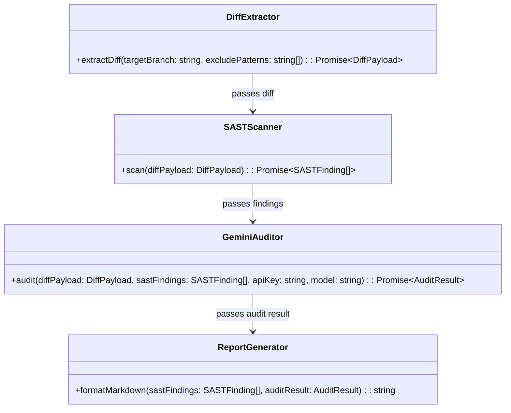

# LLD — Core Engine (`feature-core`)

**Status:** SIGNED-OFF · **Run:** keel-sec-guard · **Stack:** TypeScript (ESM), `@google/genai`, `@actions/core`  
**Serves requirements:** R1, R2, R3, R4, R5, R6

---

## Class / Type Design



| Type | Responsibility | Serves Requirements |
|------|----------------|---------------------|
| `DiffExtractor` | Extracts modified git diff lines while excluding lockfiles/binaries (`package-lock.json`, `*.lock`, `*.png`). | R1 |
| `SASTScanner` | Runs deterministic regex & AST pattern engines for high-entropy secrets and OWASP Top 10 flaws. | R2 |
| `GeminiAuditor` | Formulates structured prompt with SAST context & sends request to Google Gemini API (`@google/genai`). | R3 |
| `ReportGenerator` | Renders a standardized Markdown audit report with severity ratings (CRITICAL, HIGH, MEDIUM, LOW) and recommendations. | R4, R5 |

---

## Interfaces & Public Contracts

```typescript
export interface DiffPayload {
  rawDiff: string;
  filesChanged: string[];
  lineCount: number;
  isTruncated: boolean;
}

export interface SASTFinding {
  file: string;
  line?: number;
  ruleId: string;
  severity: 'CRITICAL' | 'HIGH' | 'MEDIUM' | 'LOW';
  description: string;
  snippet?: string;
}

export interface AuditResult {
  overallRisk: 'CRITICAL' | 'HIGH' | 'MEDIUM' | 'LOW';
  summary: string;
  findings: Array<{
    title: string;
    severity: 'CRITICAL' | 'HIGH' | 'MEDIUM' | 'LOW';
    file?: string;
    line?: number;
    description: string;
    recommendation: string;
  }>;
}
```

---

## Error Model

| Failure | Trigger | Result | Recovery / Result |
|---------|---------|--------|-------------------|
| **Missing `GEMINI_API_KEY`** | Environment variable missing in CLI / Action | Logs warning / error | Exits with error code 1 in local CLI; skips LLM scan safely in unprivileged fork CI. |
| **Git Command Failure** | Invalid git target ref or missing git binary | Throws `GitDiffError` | Output standard error instructions. |
| **Gemini Rate Limit / API Error** | HTTP 429 / 5xx from Google AI Studio | Retries with exponential backoff (max 3 retries) | Fallbacks to reporting SAST-only findings if LLM call fails. |

---

## Concurrency / Consistency Notes

- Stateless execution per run: no concurrency race conditions across files.
- Thread-safe, single-pass pipeline execution.

---

## G4 — LLD Sign-off Checklist

- [x] One-Line Test passes: a builder agent could implement `DiffExtractor`, `SASTScanner`, `GeminiAuditor`, and `ReportGenerator` from this document alone.
- [x] Every type/contract traces to a requirement (`R1`–`R6`).
- [x] Error model covers missing keys, git errors, and rate limits.
