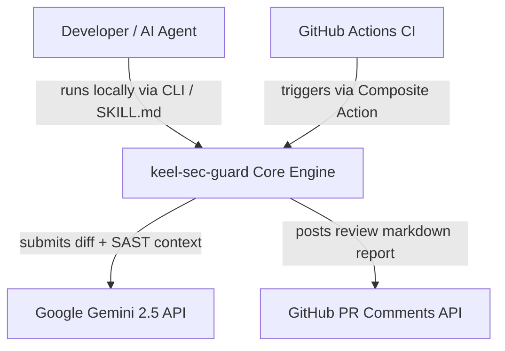
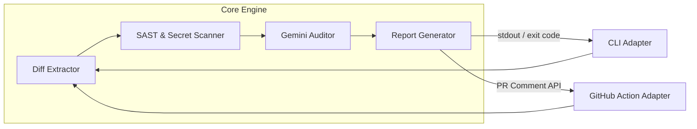
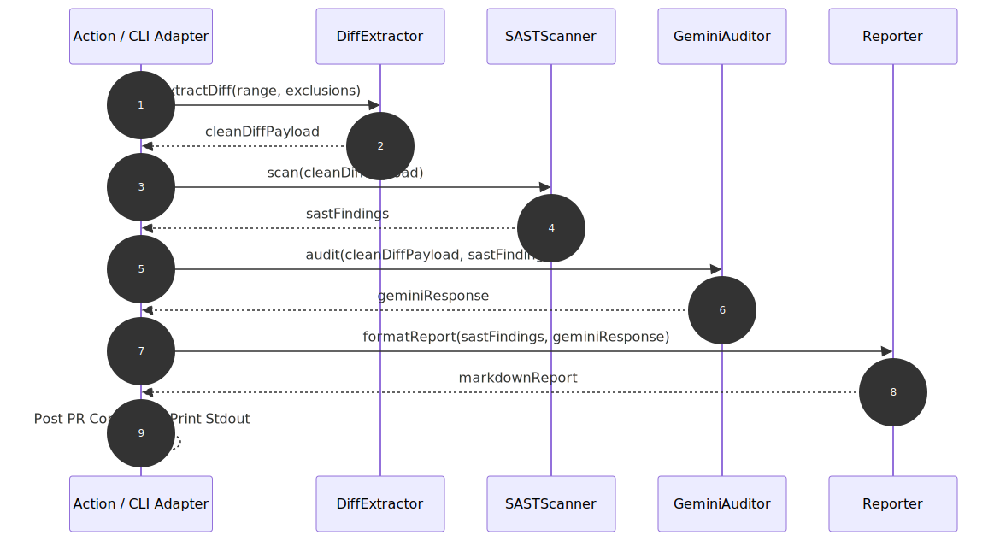
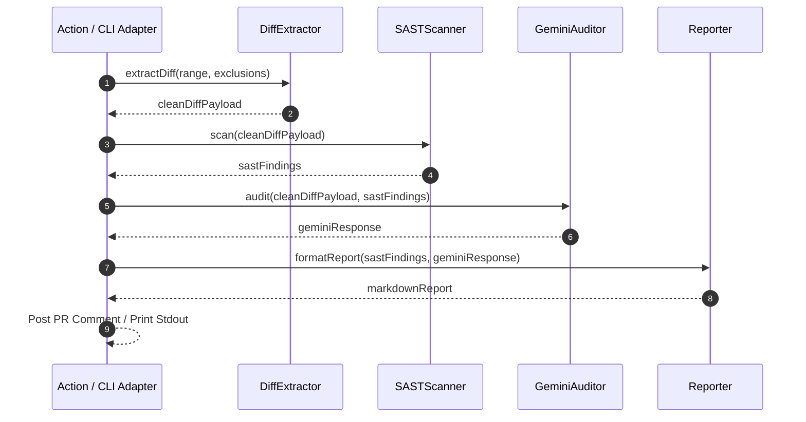

# High-Level Design — keel-sec-guard

**Status:** DRAFT · **Requirements:** see [`requirements.md`](specs/keel-sec-guard/requirements.md)

---

## Critical Design Questions

### Q1 — How to prevent API Key exfiltration when analyzing untrusted fork PRs in public repos?
- **Options:**
  - *Option A*: Use `pull_request_target` with direct secret access.
  - *Option B*: Split workflow into an unprivileged diff extractor (`pull_request`) and a sanitized runner job (`pull_request_target`) with environment approval gates.
- **Decision:** **Option B** (Split execution & Sanitized payload).
- **Why:** `Option A` exposes secrets to arbitrary code execution if an attacker modifies build scripts in a fork PR. `Option B` guarantees the runner script only receives pure string diff text and never executes PR code.

### Q2 — How to unify Local CLI execution and GitHub Action execution?
- **Options:**
  - *Option A*: Build separate CLI scripts and Action workflows.
  - *Option B*: Build a single Core Engine library that accepts a unified `AuditContext` input (diff string, options, environment type) and outputs an `AuditReport`. Adapters wrap this core engine for CLI or GitHub Action contexts.
- **Decision:** **Option B** (Core Engine + Adapter Architecture).
- **Why:** Ensures 100% logic reuse between local terminal checks and remote GitHub CI checks (R4, R5).

### Q3 — How to feed SAST findings to Gemini without overflowing token budgets or confusing the model?
- **Options:**
  - *Option A*: Send full repo files and raw SAST log dumps.
  - *Option B*: Pre-filter SAST findings into a compact JSON summary + attach the relevant git diff lines with line numbers.
- **Decision:** **Option B** (Compact Grounded Prompting).
- **Why:** Maximizes Gemini 2.5 context efficiency, eliminates hallucinations, and ensures latency stays < 15 seconds (N1, N2).

---

## C4 Level 1 — System Context

diagram source (mermaid)

---

## C4 Level 2 — Containers & Component Architecture

diagram source (mermaid)

| Component | Responsibility | Serves Requirements |
|-----------|----------------|---------------------|
| **DiffExtractor** | Parses git diffs, excludes lockfiles/binaries, truncates within token bounds. | R1 |
| **SASTScanner** | Runs deterministic regex/AST scanners for secrets & OWASP Top 10 patterns. | R2 |
| **GeminiAuditor** | Formulates structured prompt with SAST context; calls Google Gemini API. | R3 |
| **Reporter** | Generates standardized Markdown security audit report with severity scores. | R4, R5 |
| **CLIAdapter** | CLI entry point handling ANSI console output, args parsing, and exit codes. | R5 |
| **ActionAdapter** | GitHub Action entry point parsing `@actions/core` inputs and posting PR comments via `@actions/github`. | R4, R6 |

---

## Key Flows (Sequence Diagram)

diagram source (mermaid)

---

## Feature List for Low-Level Design (Phase 4)

| Feature | Description | Delivers | Target LLD |
|---------|-------------|----------|------------|
| **`feature-core`** | Diff Extractor, SAST Scanner, Gemini API Client, Report Generator | R1, R2, R3 | `features/core/lld.md` |
| **`feature-cli`** | Local CLI Binary (`npx keel-sec-guard`) & `SKILL.md` Agent Integration | R5 | `features/cli/lld.md` |
| **`feature-action`** | GitHub Composite Action (`action.yml`) & PR Comment Integration | R4, R6 | `features/action/lld.md` |

---

## G2 — HLD Sign-off Checklist

- [x] Every requirement (`R1`–`R6`) is served by at least one component.
- [x] Critical design questions (Q1: Fork security, Q2: Adapter architecture, Q3: Grounded prompt) answered with rationale.
- [x] Rendered SVG diagrams generated into `diagrams/` and embedded with source `
` blocks per Keel standards.
- [x] C4 System Context & Container diagrams are mutually consistent.
- [x] Feature list defined for Phase 4 LLD breakdown.
- [ ] **Human Sign-off (G2)**: User review required to lock HLD before Stack Selection (Phase 3).
